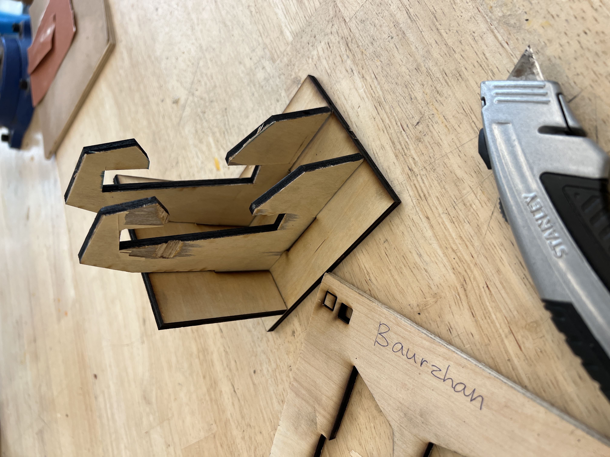
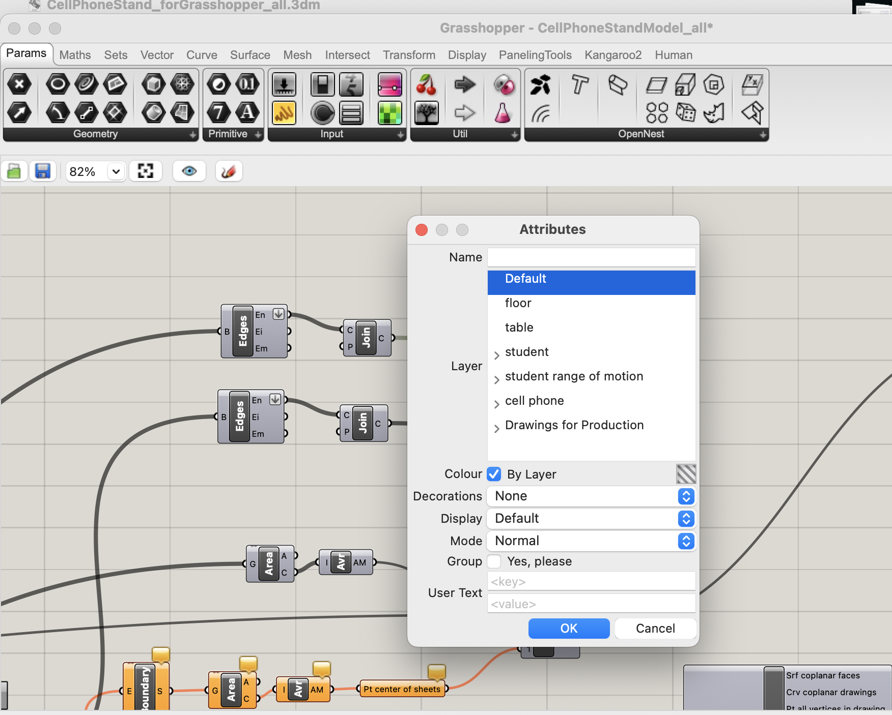

# Weekly report //10

## Summary
The whole week was basically working on project 3, I divided the work into two main parts: 
1) Exploring the ZeroWidth environment
2) Connecting ZeroWidth's API to a web-app.

Overall, working with ZeroWidth was a cool opportunity to learn about LLMs and related features and making an actual product using an LLM. Although I wasn't very into experimenting too much with the controls (like temperature, different models, etc.), I loved the process of using it as a tool and integrating it into a webapp.

## Terminology (just for my note)
**RAG (Retrieval Augmented Generation)** - is basically making an LLM connect to some database/sources from where it can retrieve and give the most relevant, up-to-date and accurate information. It also innvolves  using additional instructions for the LLM linked to the original prompt passed by a user. Without RAG, an LLM would give responses based on the info gathered before its training. RAG is convenient because now we don't have to retrain the whole model to give up-do-date info.

## Process
 
First, probably as most of the students from our cohort I just put some instructions saying like "you are Baurzhan, an MDes student...", and wanted to test on a demo:

 
And based on the answer, I understood that I need some more context..
So, I literally wrote "you are not an AI programmed to mimic Baurzhan, you are actually him" kind of instruction:

 
And this worked! 
Also, at this point I was already tired of asking it each time "who are you", so I decided to add a welcoming instruction so it was more like a chat bot experience.

 
Additionally I just thought that this might be useful for future portfolio website integration.
  
The next step was adding the knowledge sets:

 
From funny things, I decided to instruct my intelligence to write in style of a Kazakh poet Abai Kunanbayev and end sentences with a smily ':D' character:

 
Now, since the main requirements were done, I wanted to connect to the API and build an app. First, I made simple app that only had a .html file just to see if I can make it quickly. However, I encountered an error:

 
I remember this error from project 2 when trying to send events from a web app to 2 photons, and the problem was that I was trying to make an API request directly from the client side, and the possible ways to solve this issue was to use some framework or tool and trying to connect from the server side.
  
So, using Shm's nodejs-starter-code once again, I built the app:

 
 
 
 
 

# Weekly report //9

## Summary
After our team project ended last week, and we began working on our own projects, I've been reflecting on how I did on project 2, to submit a report for Monday. Then spent some time experimenting with the ZeroWidth Workbench. This week has been pretty tough because I had a lot of assignments from my other classes.

## Process
 
Went through the Project requirements

 
And through the related articles

 
 
 
 
 

# Weekly report //8

## Summary
So, this week mainly focused on making the web page work, and it eventually did (Shm and his node js starter code helped a lot:D). However, all UI I had was just one button on a blank page. So, after it worked I spent a little time on making the UI of our product look better (mainly was inspired by the existing Apple Watch meditation app's UI).

## Process
The final UI:
 

 
Initially it doesn't have the "breath-in/out" texts, only a starting button. After "Turn ON!" button is pressed and the corresponding event is sent, it displays "breath-in" for 4 seconds, "hold" for a sec and "breath-out" for 4 seconds (just like our mechanical flower and bracelet are set).

 
 
 
 
 

# Weekly report //7

## Summary
Last week, after we finished our paper prototype and sketches, we split our team into three smaller groups: one for working on the flower's mechanics, another for the vibrating bracelet's mechanics, and the last one for cloud programming. I was impressed by how well each group worked; they had already completed and tested the initial mechanical components. While my main job is cloud programming, I also helped with the flower's mechanics and the paper prototype. Right now, I'm trying to figure out how to send events from the cloud to the photon. Overall, I think I did a good job this week.

## Process
 
Prof. Sudhu suggested a tutorial for turning on LED from internet, and I started following it

 
But then I realized that using function may not be a good fit for our team's case, since it's only useful when manipulating with one device:

 
But I found another tutorial which uses publish and subscribe to achieve a similar task, and was mainly doing based on that:

 

 
 
 
 
 

# Weekly report //6

## Summary
This week was mostly related to ideation for our project and working on the specifications. The link to the specifications is: https://docs.google.com/document/d/1IRLeagtgZijVZ8jcxHtoBIZcy9kE9jKGmdVBJSnqfk4/edit. Also, I finally sorted out the weekly-reports folder in my repository (at the beginning it was all messed up: and all images and reports were together):
 

 
 
 
 
 

# Weekly report //5

## Summary
This week we started with setting up the Photon 2, developing three project ideas for a given field, and then choosing best 3 among all to work on for the next 3-4 weeks. 
 

## Process
First, I wasn't able to prepare the photon 2 in advance for the class on Friday, and when prof. Sudhu started showing the tutorial in class, I thought I wouldn't be able to catch up with everyone else. And was sitting and looking at Jingyi's work, until she suggested me to use the hotspot to do the initial setup. So, I was able to do it in class:

 
 
Then, following the tutorial on git, made the LED blink:

 
 
On Tuesday we were brainstorming on project ideas, our scope was "Agriculture" and we actually did well and came up with many great ideas. However, I was a little bit upset to work on "Agriculture" related project (just because it's not a field I'm interested in and have no prior experience). But it ended up that we choose a project ourselves from the pool of all ideas (which is veery cool!), so I chose my top 3:

 
Based on my interests and experience, I chose: 
1) Enhancing Interpersonal Connections: Exploring Subtle Communication Tools for Friendships and Relationships 
2) Mindful Meditations: An Interactive Flower Guide for Stress Relief and Color Therapy Tracking 
3) Collaborative Song Crafting: Empowering Local Music Enthusiasts with Asynchronous Music Creation

 
 
 
 
 

# Weekly report //4

## Summary

I spent most of my days this week working on a project from my elective course since it's related to the field I want to explore now. But I'm also very intterested in the 2nd TDF project and is related to my background. So, hopefully will really challenge myself this time.

For now, nothing to say, and I've got my kit:)
 

 
 
 
 
 

# Weekly report //3

Finally made it! :D

## Reflections

This week was a bit easier (hopefully made some progress), I watched TJ's youtube tutorial for the simpler version of the cell phone stand and it made a lot of things indeed clearer. Untill now I didn't understand why do we always have an additional data structure to store some value, but it seems that it just makes it easier to navigate in the file and now "what stores what" kinf of things (since you also usually give some name for this data structure containing a point/plane/shape/etc.).. 
  
Also Fareha helped me a lot with my final laser cut, she had a same issue with the stand being loose and unstable, so she suggested me to decrease material thickness from 6mm to 5mm which makes the holes actually a bit smaller than the needed size, but a rubber hammer makes everything perfect at the end.

## Process
As said, first started with TJ's tutorial:

 
 
And was simultaneously analyzing the provided Rhino and grasshoper projects:

 
 
And, after understanding the basic navigation inside the software, I decided to make my own slightly customized stand. Actually my last cut fit my smartphone quite well, but it was a bit uncomfortable since it had parts of frame from above, making it a bit difficult to insert a phone, and as was said it was also a little bit loose and unstable:

 
 
I adjusted the provided project in the way I wanted the stand to be:

 
 
Made my 3rd cut:

 
 
and here is the result:

 
 
 
 
 

# Weekly report //2

## Reflections

For this week, I worked on the laser cut handle, last class it didn't really cut through, and I should have checked that before removing one piece (so that I could laser cut it again), but now at least I know how to do that properly. I'm still struggling with the Rhino and grashoper.. 

## Process
Last time, my laser-cut failed, it looked okay at the beginning:

but when I looked at the back side it was aparent that it didn't cut through:

So I used a box cutter to cut them manually by hand:

 
 
 
 
 

# Weekly report //1

## Reflections

Overall, I learnt that it’s VERY important to start working on the project and homeworks ASAP, and my first laser cut printing attempt shows this, but it’s still okay, glad that I learnt this early enough.
There were lots of things this first week, so needed some time to adjust..

## Process
First, I just opened the Rhino and was trying to figure out the way to change things:

  

Then I realized that I was looking at a wrong file haha, so asked Vidit and he suggested me to look at the CellPhoneStandModel_all file; so here I was on the right path:

  

I made some small changes, baked the file and exported the .ai file:

  

Then I passed the quiz for the laser cutting printers at the 2nd attempt (now I know that you cannot leave a laser cutter while it's printing:D):

   

At Jacobs, had some issues with signing in to Creative Cloud:

  

For some reason the dimensions were shrinked when I opened the file on Illustrator at the lab machine, so this is what I got:

  

Also, because it was shrinked, the thinkness of the material wasn't suitable for the model:

  

 
 
 
 
 

# Hello DES INV 202 Student!
Welcome to your new GitHub repository! 

If you’re new to GitHub, you can think of this as a shared file space (like a Google Drive folder, or a like a USB drive that’s hosted online.) 

This is your space to store project files, videos, PDFs, notes, images, etc., and (hopefully, neatly) organize so it's easy for viewers (and you!) to navigate. That said, it’s super easy for you to share any file or folder with us (your TDF instructional team) - just send us the link! 

The specific file that I’m typing into right now is the **README.md** for this repo. 
##### (💡 TIP: The .md indicates that we’re using [Markdown formatting.](https://www.markdownguide.org/cheat-sheet/)) #####
<h6> (💡 TIP 2: GitHub Markdown supports <a href="https://gist.github.com/seanh/13a93686bf4c2cb16e658b3cf96807f2"> <em>HTML formatting</em> too, including emojis 😄</a>, in case that helps!) </h6>

### :star: Whatever you write in your **README.md** will show up on the “front page” of your GitHub repo. This is where we’ll be looking for your [weekly progress reports](https://github.com/Berkeley-MDes/desinv-202/wiki/3.0-Weekly-Submissions). They might look something like this: ###
---
# Example Report 1 - Week of 08/21/2023 #
This week, I designed a cool phone stand made of rocks. Check out all my cool sketches and progress photos from this week below, etc., etc....

---

or, if you prefer, you can create separate files and link to them here, like so:

---
[Example Report 1](weekly-reports/example-report-1.md)
---

Either way, it's time to start making this space your own! If you want to save these instructions -- Don't worry, I already copied them over to another file for you [here.](welcomeREADME.md) So feel empowered to delete everything in this README.md and start documenting! 

sparkles,

your TDF TA, shm :sparkles:

PS: let me know if you have any questions!!

--- 
PPS: 
## Quick Links, compiled here for your convenience: ##

- [TDF Wiki](https://github.com/Berkeley-MDes/desinv-202/wiki) - the ultimate source for truth and information about the course and assignments
- [Google Drive Folder](https://drive.google.com/drive/folders/1OjFgu4llHn-2WayQFVWRKFyOkQ_WaQRx?usp=drive_link) - slides and other resources
- [bCourses](https://bcourses.berkeley.edu/courses/1528355) - where the grading happens

