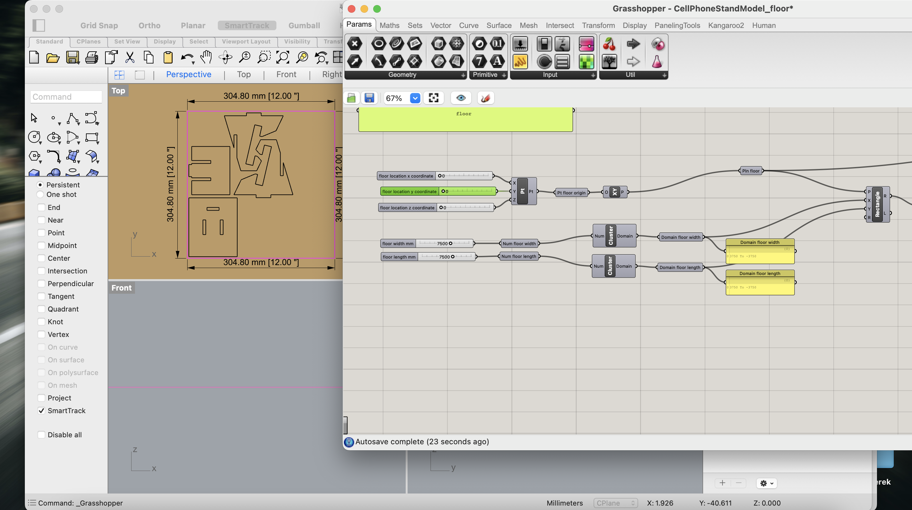
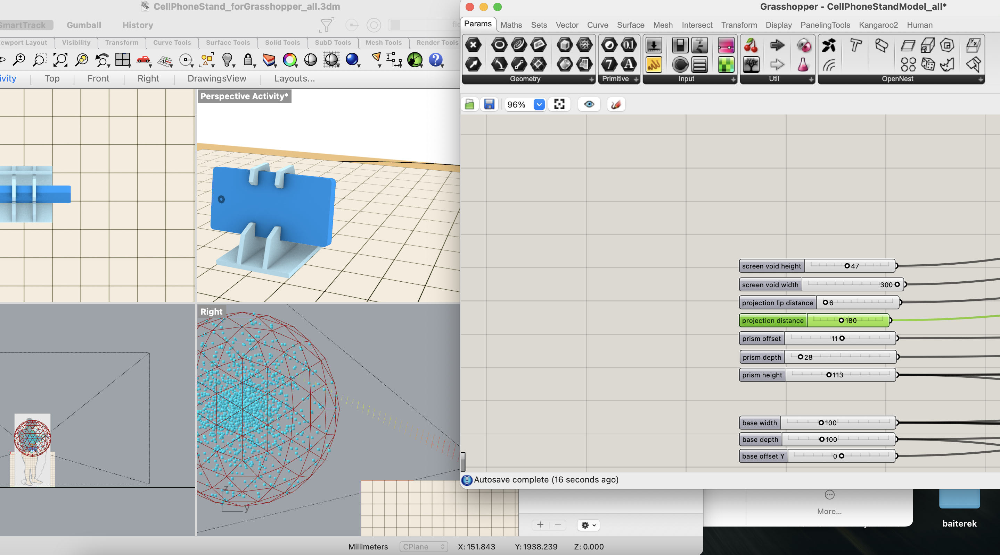
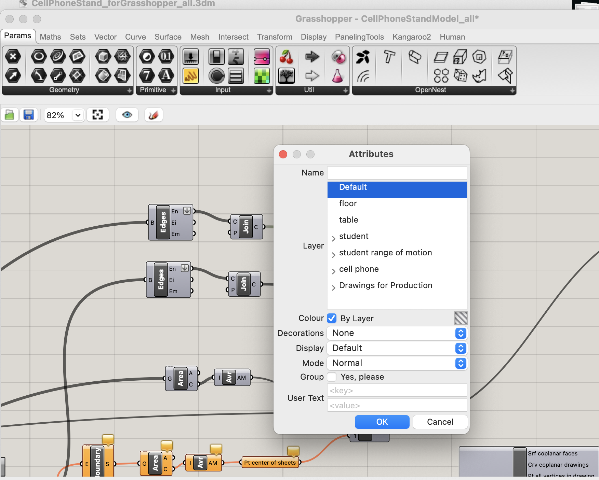
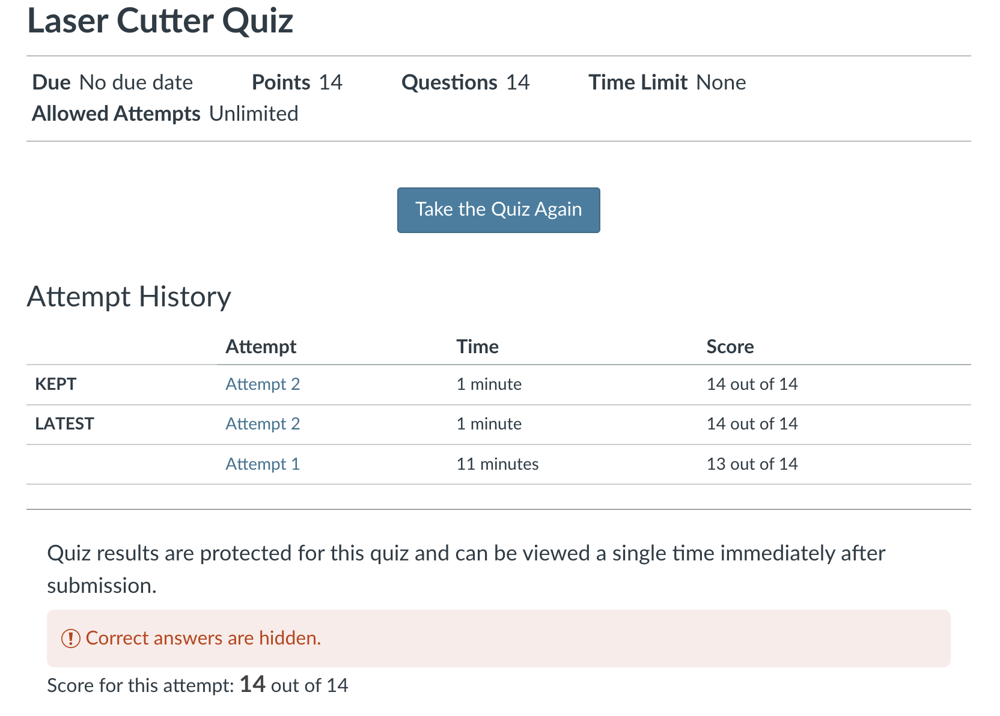

# Weekly report number 1

## Reflections

Overall, I learnt that it’s VERY important to start working on the project and homeworks ASAP, and my first laser cut printing attempt shows this, but it’s still okay, glad that I learnt this early enough.
There were lots of things this first week, so needed some time to adjust..

## Process
First, I just opened the Rhino and was trying to figure out the way to change things:

Then I realized that I was looking at a wrong file haha, so asked Vidit and he suggested me to look at the CellPhoneStandModel_all file; so here I was on the right path:

I made some small changes, baked the file and exported the .ai file:

Then I passed the quiz for the laser cutting printers at the 2nd attempt (now I know that you cannot leave a laser cutter while it's printing:D):

