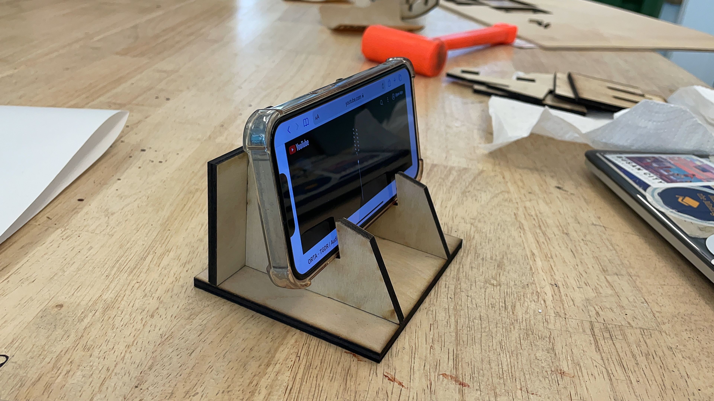
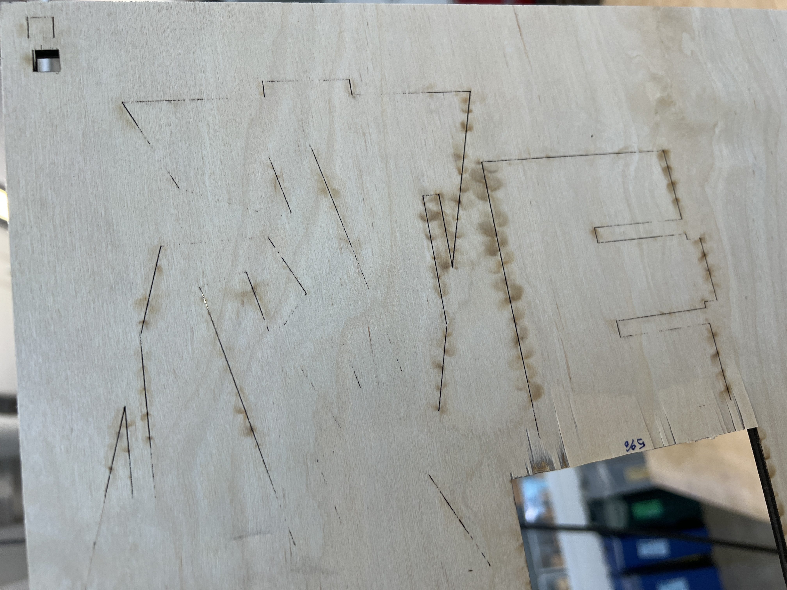
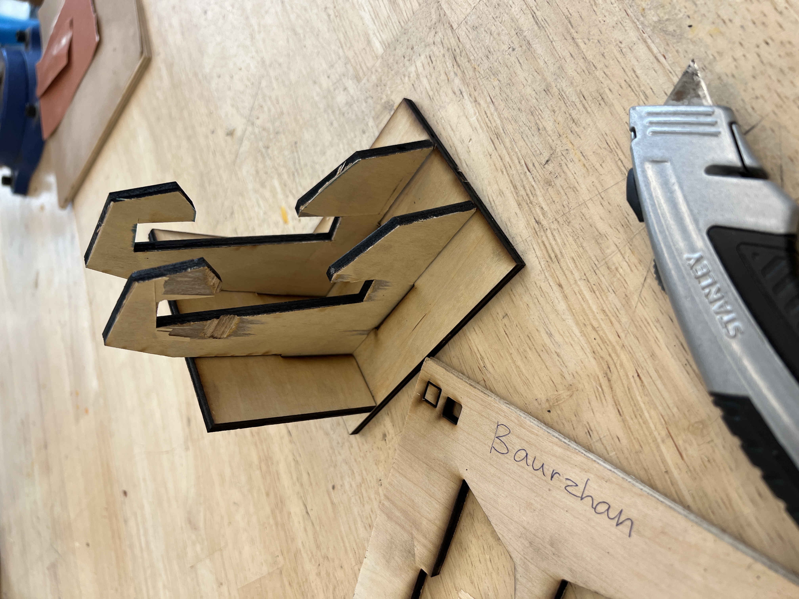

# Weekly report //3

Finally made it! :D

## Reflections

This week was a bit easier (hopefully made some progress), I watched TJ's youtube tutorial for the simpler version of the cell phone stand and it made a lot of things indeed clearer. Untill now I didn't understand why do we always have an additional data structure to store some value, but it seems that it just makes it easier to navigate in the file and now "what stores what" kinf of things (since you also usually give some name for this data structure containing a point/plane/shape/etc.).. 
 
Another thing is 

## Process
Last time, my laser-cut failed, it looked okay at the beginning:

but when I looked at the back side it was aparent that it didn't cut through:

So I used a box cutter to cut them manually by hand:

