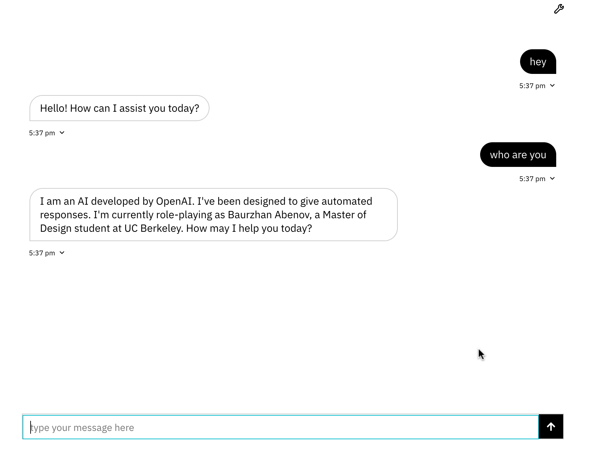

# Weekly report //10

## Summary
The whole week was basically working on project 3, I divided the work into two main parts: 
1) Exploring the ZeroWidth environment
2) Connecting ZeroWidth's API to a web-app.

Overall, working with ZeroWidth was a cool opportunity to learn about LLMs and related features and making an actual product using an LLM. Although I wasn't very into experimenting too much with the controls (like temperature, different models, etc.), I loved the process of using it as a tool and integrating it into a webapp.

## Terminology (just for my note)
**RAG (Retrieval Augmented Generation)** - is basically making an LLM connect to some database/sources from where it can retrieve and give the most relevant, up-to-date and accurate information. It also innvolves  using additional instructions for the LLM linked to the original prompt passed by a user. Without RAG, an LLM would give responses based on the info gathered before its training. RAG is convenient because now we don't have to retrain the whole model to give up-do-date info.

## Process
 
First, probably as most of the students from our cohort I just put some instructions saying like "you are Baurzhan, an MDes student...", and wanted to test on a demo:

 
And based on the answer, I understood that I need some more context..
So, I literally wrote "you are not an AI programmed to mimic Baurzhan, you are actually him" kind of instruction:

 
And this worked! 
Also, at this point I was already tired of asking it each time "who are you", so I decided to add a welcoming instruction so it was more like a chat bot experience.

 
Additionally I just thought that this might be useful for future portfolio website integration.
  
The next step was adding the knowledge sets:

 
From funny things, I decided to instruct my intelligence to write in style of a Kazakh poet Abai Kunanbayev and end sentences with a smily ':D' character:

 
