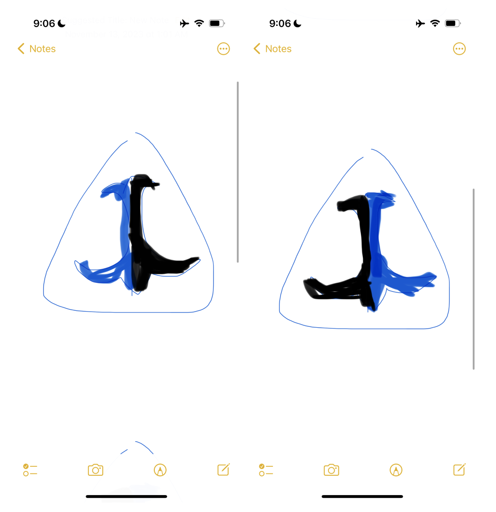

# Weekly report //12

## Summary
This week I was mainly researching and interviewing people around (about long distance relationship communications devices) to further refine my idea  for the final personal project and narrow down the scope. Specifically, I talked to our senior cohort 3 MDes students while working in the studio and actually came up with cool advice and even had a genius idea (:D) coming to my mind right in the middle of the conversation with one of the seniors. The new concept draws inspiration from Kazakh culture.

Also, we a had the Final Project Proposal submission where I kind of collected all my findings into one document.

Finally, right before the last lecture for this week Rachel expressed interest in joining my project. So, now it's two of us working on the long distance communication device, which is very cool since she also has a background in CS and we can work together on software and hardware code as well as this project requires at least 2 microcontrollers.

## Process
 
First, I talked to about 5-6 senior students about my idea and jotted down some takeaways and suggestions in my notes:

 
We also came to a conclusion that every MDes cohort had a student working on a project with a similar idea XD.

********
Furthermore, I came up to this idea of using the shape of Kazakh Tumars (a neckless amulet) as a form factor for my device.

 

********
I noticed that I get quite serious whenever there is a cultural element involved in my projects, and I actually set up a call with a UK-based Kazakh artist who makes very beautiful traditional jewelry with ancient kazakh ornaments (traditional shapes). She helped a lot with researching the ornaments that I might use for our device, and we had a hall chat exchanging different findings:

 
Additionally I just thought that this might be useful for future portfolio website integration.
  
The next step was adding the knowledge sets:

 
From funny things, I decided to instruct my intelligence to write in style of a Kazakh poet Abai Kunanbayev and end sentences with a smily ':D' character:

 
Now, since the main requirements were done, I wanted to connect to the API and build an app. First, I made simple app that only had a .html file just to see if I can make it quickly. However, I encountered an error:

 
I remember this error from project 2 when trying to send events from a web app to 2 photons, and the problem was that I was trying to make an API request directly from the client side, and the possible ways to solve this issue was to use some framework or tool and trying to connect from the server side.
  
So, using Shm's nodejs-starter-code once again, I built the app:

