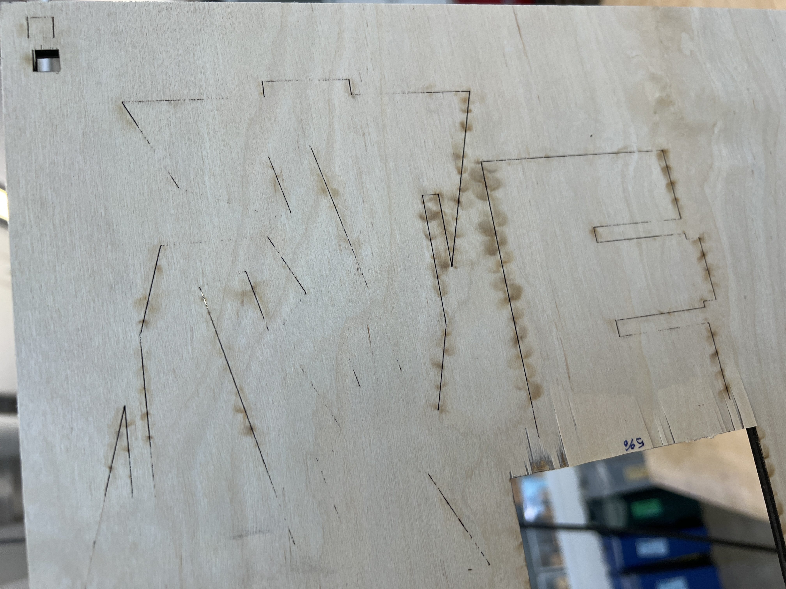
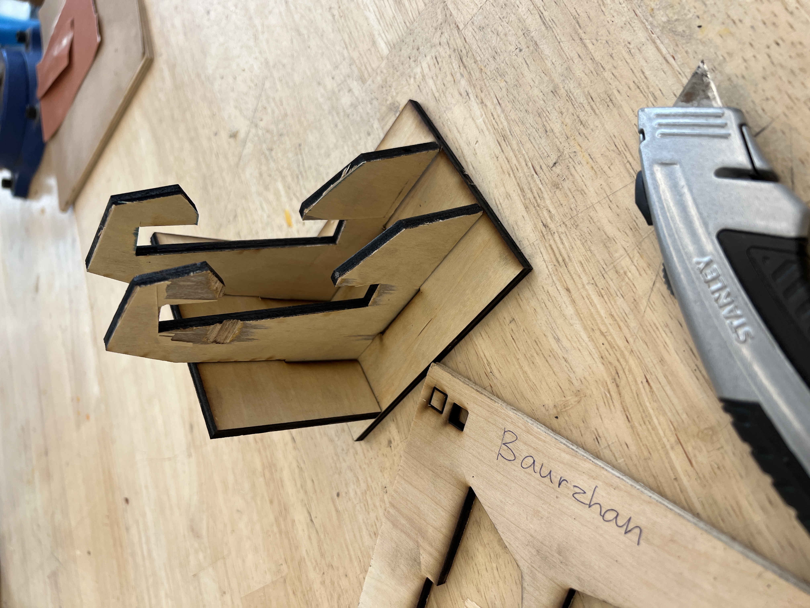

# Weekly report //2

## Reflections

For this week, I worked on the laser cut handle, last class it didn't really cut through, and I should have checked that before removing one piece (so that I could laser cut it again), but now at least I know how to do that properly. I'm still struggling with the Rhino and grashoper.. 

## Process
Last time, my laser-cut failed, it looked okay at the beginning:

but when I looked at the back side it was aparent that it didn't cut through:

So I used a box cutter to cut them manually by hand:

