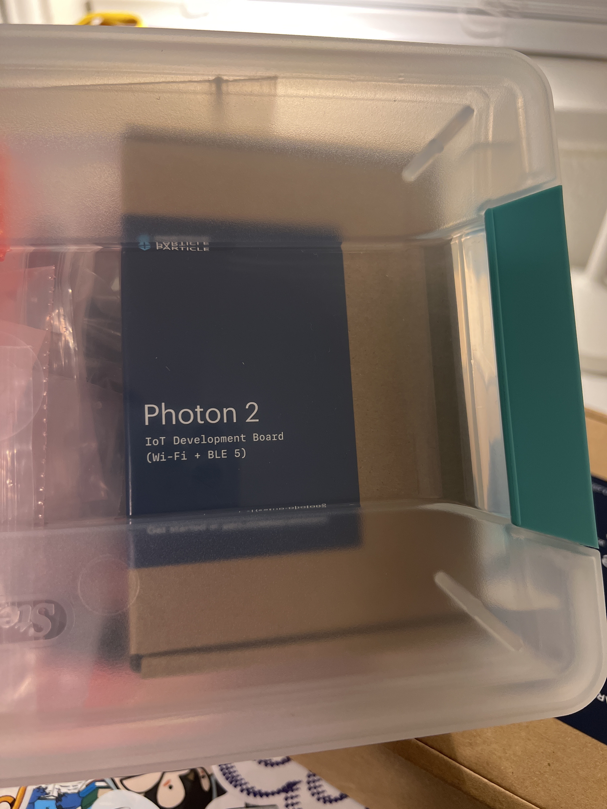

# Weekly report //4

## Reflections

This week was a bit easier (hopefully made some progress), I watched TJ's youtube tutorial for the simpler version of the cell phone stand and it made a lot of things indeed clearer. Untill now I didn't understand why do we always have an additional data structure to store some value, but it seems that it just makes it easier to navigate in the file and now "what stores what" kinf of things (since you also usually give some name for this data structure containing a point/plane/shape/etc.).. 
  
Also Fareha helped me a lot with my final laser cut, she had a same issue with the stand being loose and unstable, so she suggested me to decrease material thickness from 6mm to 5mm which makes the holes actually a bit smaller than the needed size, but a rubber hammer makes everything perfect at the end.

 
 
And was simultaneously analyzing the provided Rhino and grasshoper projects:

