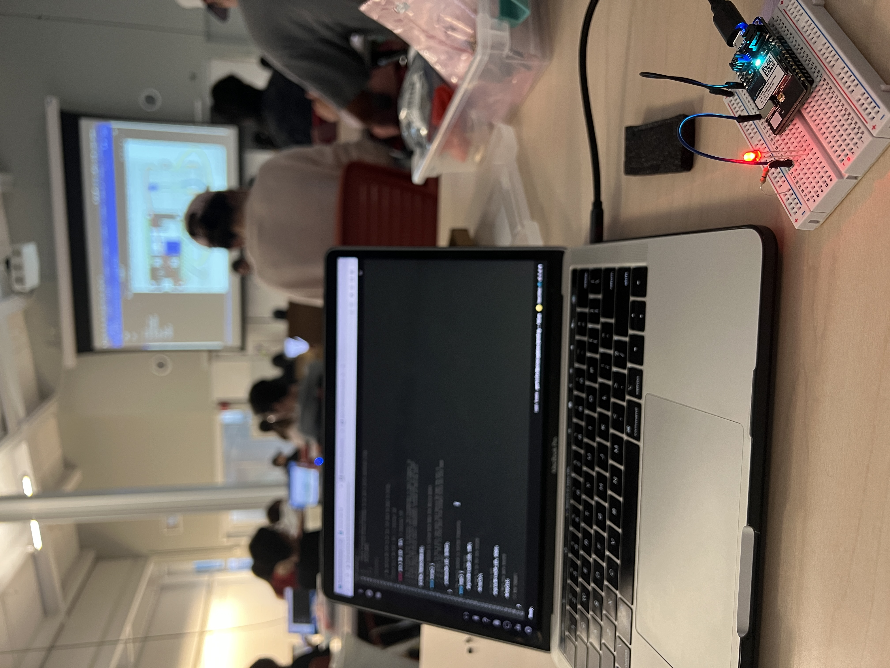
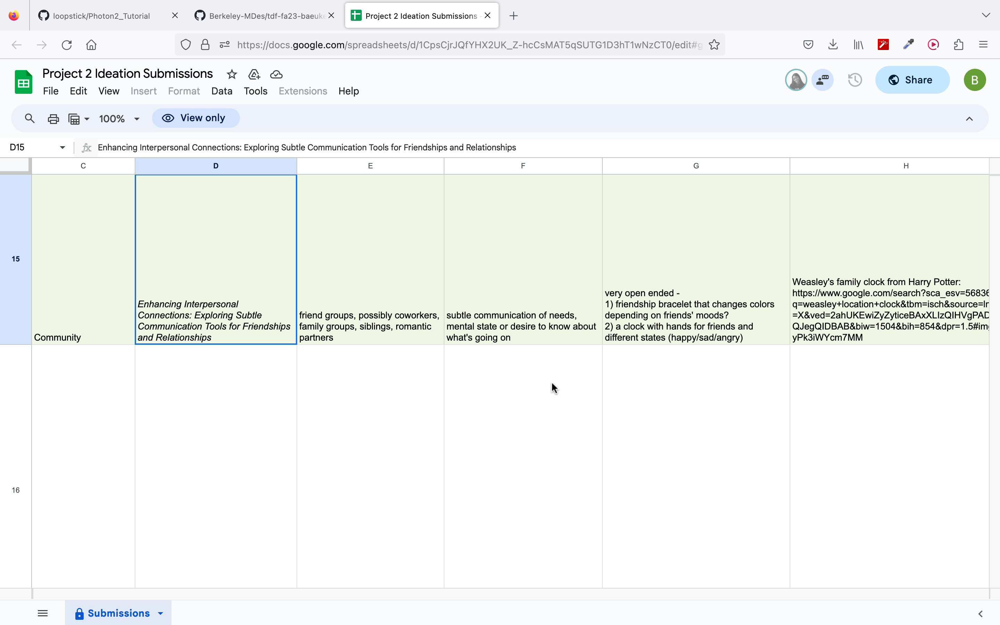

# Weekly report //5

## Summary
This week we started with setting up the Photon 2, developing three project ideas for a given field, and then choosing best 3 among all to work on for the next 3-4 weeks. 
 

## Process
First, I wasn't able to prepare the photon 2 in advance for the class on Friday, and when prof. Sudhu started showing the tutorial in class, I thought I wouldn't be able to catch up with everyone else. And was sitting and looking at Jingyi's work, until she suggested me to use the hotspot to do the initial setup. So, I was able to do it in class:

 
 
Then, following the tutorial on git, made the LED blink:

 
 
On Tuesday we were brainstorming on project ideas, our scope was "Agriculture" and we actually did well and came up with many great ideas. However, I was a little bit upset to work on "Agriculture" related project (just because it's not a field I'm interested in and have no prior experience). But it ended up that we choose a project ourselves from the pool of all ideas (which is veery cool!), so I chose my top 3:

