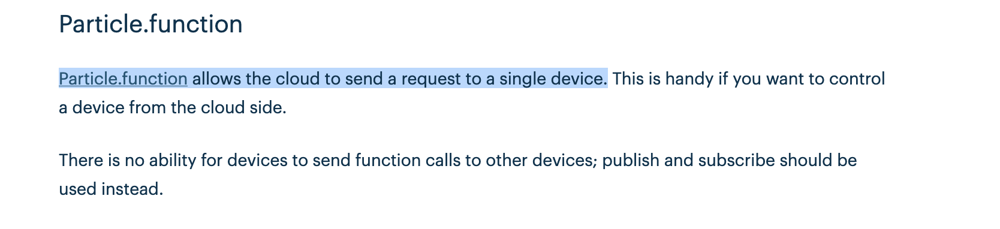
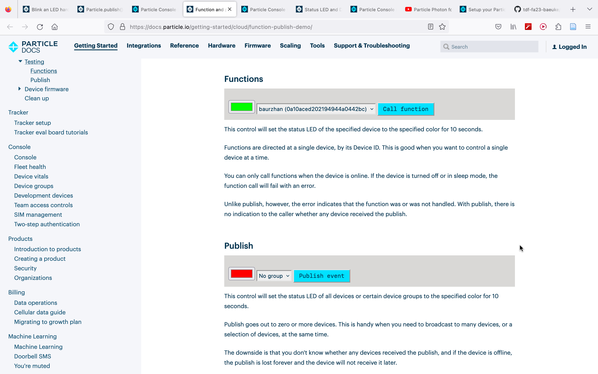

# Weekly report //7

## Summary
Last week, after we finished our paper prototype and sketches, we split our team into three smaller groups: one for working on the flower's mechanics, another for the vibrating bracelet's mechanics, and the last one for cloud programming. I was impressed by how well each group worked; they had already completed and tested the initial mechanical components. While my main job is cloud programming, I also helped with the flower's mechanics and the paper prototype. Right now, I'm trying to figure out how to send events from the cloud to the photon. Overall, I think I did a good job this week.

## Process
 
Prof. Sudhu suggested a tutorial for turning on LED from internet, and I started following it

 
But then I realized that using function may not be a good fit for our team's case, since it's only useful when manipulating with one device:

 
But I found another tutorial which uses publish and subscribe to achieve a similar task, and was mainly doing based on that:

 

