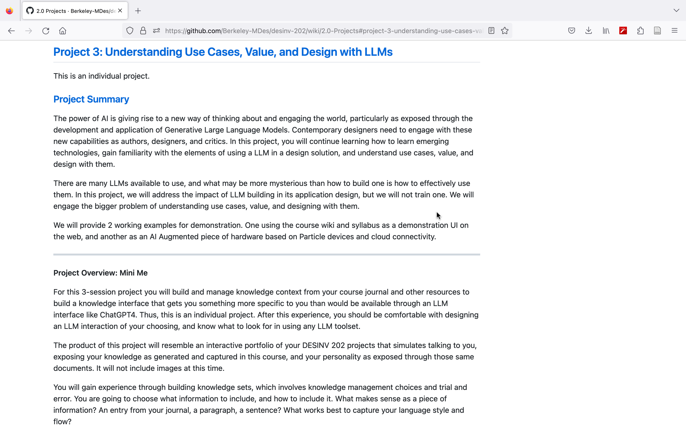

# Weekly report //9

## Summary
After our team project ended last week, and we began working on our own projects, I've been reflecting on how I did on project 2, to submit a report for Monday. Then spent some time experimenting with the ZeroWidth Workbench. This week has been pretty tough because I had a lot of assignments from my other classes.

## Process
 
Went through the Project requirements

 
And through the related articles

